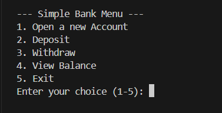
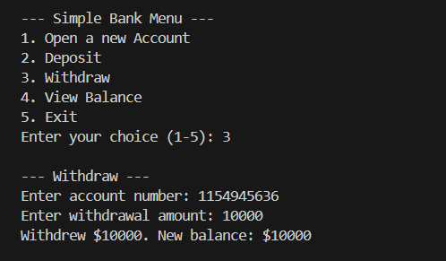

# BankingApp Console Application

This is a simple console application built with C# and .NET to simulate a basic banking system. This project was built to demonstrate core Object-Oriented Programming (OOP) principles.

## Core Concepts Demonstrated

* **Classes & Objects:** `Account`, `SavingsAccount`, `CheckingAccount`, and `Bank` classes.
* **Inheritance:** `SavingsAccount` and `CheckingAccount` inherit from a base `Account` class.
* **Polymorphism:** The `Withdraw()` method is overridden in the `CheckingAccount` class to provide its own special logic (overdraft fees).
* **Encapsulation:** Properties (`{ get; set; }`) and `private` fields are used to manage data.
* **Collections:** A `List<Account>` is used in the `Bank` class to hold all customer accounts.

## Features

* Open new checking or savings accounts.
* Deposit funds into any account.
* Withdraw funds (with special overdraft rules for checking accounts).
* View account balances.
* Find accounts using a unique, randomly-generated account number.

## Screenshots

Here is the main menu of the application:

Here is a demonstration of the overdraft fee on a checking account:

